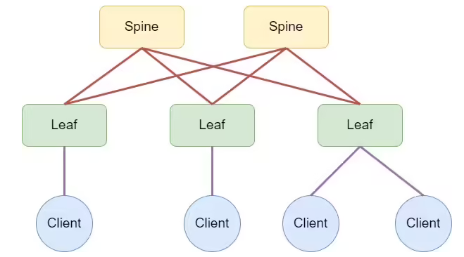
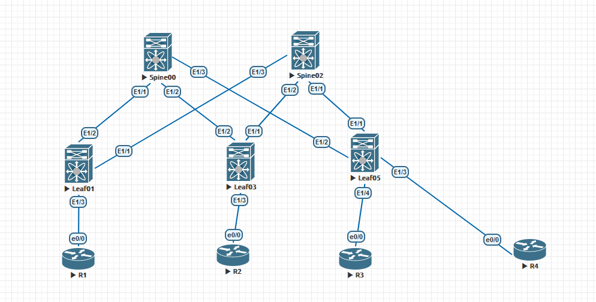

# OTUS - Дизайн сетей ЦОД
***
## LAB 01 - Проектирование адресного пространства

### -Цели
1. Соберите топологию CLOS, как на схеме:

2. Распределите адресное пространство для Underlay сети
3. План работы, адресное пространство, схема сети, настройки - зафиксированы в документации
Документация оформлена на github (markdown)

								Выполнение Работы
	

	При выполнении работы использовался эмулятор сетевых устройств  Eve-NG 5.0.1-13. Были задействованы следующие образы:
- 	Nexus 9000v(nxos.7.0.3.I7.2.bin)
- 	Cisco IOL (L3-ADVENTERPRISEK9-M-15.4-2T.bin)

#### 1. Топология сети

###### * Рис 1. Топология сети*

Нумерация сетевых устройств была выбрана исходя из будущей адресации сети, как видим сетевые ус-ва, выполняющие роль "Spine"  будут иметь четные номера, а роль "Leaf" возьмет  на себя нечетные номера.

План адресации сети будет иметь следующий вид:

10.X.Y.Z, где:

*X- Номер площадки*

Под каждую площадку выделяется сеть 10.x.0.0/13 содержащей в себе сети размером по /16 маске, несущие в себе функцию определения сервисов, к примеру:

- 10.0.0.0 - 10.7.255.255 - Площадка 1
- 10.8.0.0 - 10.15.255.255 Площадка 2

Где в свою очередь: 0-7 и другие имеют следующие функции:

- 0 - loopback 0
- 1 - loopback 1
- 2 - p2p links
- 3 - reserver
- 4-7 - services

*Y - Номер Spine/Leaf*

Spine устройства будут иметь четную номерацию, Leaf - нечетную, т.е: 

+ 10.0.0.1 - loopback 0 на Spine00
+ 10.0.1.1 - loopback 0 на Leaf01
+ 10.1.3.1 - loopback 1 на Leaf03
+ 10.1.4.1 - loopback 1 на Spine04

*Z - Номер по порядку*

Назначается с единицы по возрастанию в соответствии с уже имеющимся
 IP-адресами
 
Также:

*Loopback  интерфейсы используют  /32 IP адреса*

*P2P интерфейсы используют /30 IP адреса*

Адресация в соответствии планом на данной топологии представлена ниже:

| Сетевое ус-во | Интерфейс | IP-адрес |
| --- | --- | --- |
| Leaf01 | Lo0 | 10.0.1.1 |
| Leaf01|Lo1|10.1.1.1|
| Leaf01|Eth 1/1|10.2.2.2|
| Leaf01|Eth 1/2|10.2.0.2|
| Leaf03|Lo0|10.0.3.1|
| Leaf03|Lo1|10.1.3.1|
| Leaf03|Eth 1/1|10.2.2.6|
| Leaf03|Eth 1/2|10.2.0.6|
| Leaf05 |Lo0|10.0.5.1|
|Leaf05|Lo1|10.1.5.1|
|Leaf05|Eth 1/1|10.2.2.10|
|Leaf05|Eth 1/2|10.2.0.10|
| Spine00 |Lo0|10.0.0.1|
| Spine00 |Lo1|10.1.0.1|
| Spine00 | Eth 1/1 | 10.2.0.1 |
| Spine00 | Eth 1/2 | 10.2.0.5 |
| Spine00 | Eth 1/3 | 10.2.0.9 |
| Spine02|Lo0|10.0.2.1|
| Spine02|Lo1|10.1.2.1|
| Spine02|Eth 1/1|10.2.2.9|
| Spine02|Eth 1/2|10.2.2.5|
| Spine02|Eth 1/3|10.2.2.1|

###### * Табл 1. Адресация сетевых ус-в*

#### Внесем конфигурацию:  
Дадим hostname устройствам,выключим автоматический резолв имен и настроим адресаю на интерфейсах,аутентификаю настраивать на стэнде не будем.

	Spine00 :
		hostname Spine00
		
		no ip domain-lookup
		
		interface loopback0
		  ip address 10.0.0.1/32
		  
		interface loopback1
		  ip address 10.1.0.1/32
		  
		line console
		  exec-timeout 0
		  
		line vty
		
		boot nxos bootflash:/nxos.7.0.3.I7.2.bin
		
		interface Ethernet1/1
		  description TO_LEAF_01
		  no switchport
		  ip address 10.2.0.1/30
		  no shutdown
	
		interface Ethernet1/2
		  description TO_LEAF_03
		  no switchport
		  ip address 10.2.0.5/30
		  no shutdown
	
		interface Ethernet1/3
		  description TO_LEAF_05
		  no switchport
		  ip address 10.2.0.9/30
		  no shutdown
		  
	Spine02:
		hostname Spine02
		
		no ip domain-lookup
		
		interface Ethernet1/1
		  description TO_LEAF_05
		  no switchport
		  ip address 10.2.2.9/30
		  no shutdown
	
		interface Ethernet1/2
		  description TO_LEAF_03
		  no switchport
		  ip address 10.2.2.5/30
		  no shutdown
	
		interface Ethernet1/3
		  description TO_LEAF_01
		  no switchport
		  ip address 10.2.2.1/30
		  no shutdown
		  
		  interface loopback0
			ip address 10.0.2.1/32
			
		interface loopback1
		  ip address 10.1.2.1/32
		  
		line console
		  exec-timeout 0
		  
		line vty
		
		boot nxos bootflash:/nxos.7.0.3.I7.2.bin
	
	Leaf01:
		hostname Leaf01
		
		no ip domain-lookup
		
		interface Ethernet1/1
		  description TO_SPINE_02
		  no switchport
		  ip address 10.2.2.2/30
		  no shutdown
	
		interface Ethernet1/2
		  description TO_SPINE_00
		  no switchport
		  ip address 10.2.0.2/30
		  no shutdown
		  
		interface loopback0
		  ip address 10.0.1.1/32
	
		interface loopback1
		  ip address 10.1.1.1/32
		  
		line console
		  exec-timeout 0
		  
		line vty
		
		boot nxos bootflash:/nxos.7.0.3.I7.2.bin
		
	Leaf03:
		hostname Leaf03
		
		no ip domain-lookup
		
		interface Ethernet1/1
		  description TO_SPINE_02
		  no switchport
		  ip address 10.2.2.6/30
		  no shutdown
	
		interface Ethernet1/2
		  description TO_SPINE_00
		  no switchport
		  ip address 10.2.0.6/30
		  no shutdown
		  
		interface loopback0
		  ip address 10.0.3.1/32
	
		interface loopback1
		  ip address 10.1.3.1/32
		line console
			exec-timeout 0
		line vty
		
		boot nxos bootflash:/nxos.7.0.3.I7.2.bin
		
		
	Leaf05:
		hostname Leaf05
		
		no ip domain-lookup
		
		interface Ethernet1/1
		  description TO_SPINE_02
		  no switchport
		  ip address 10.2.2.10/30
		  no shutdown
	
		interface Ethernet1/2
		  description TO_SPINE_00
		  no switchport
		  ip address 10.2.0.10/30
		  no shutdown
		  
		interface loopback0
		ip address 10.0.5.1/32
	
		interface loopback1
		  ip address 10.1.5.1/32
		line console
			exec-timeout 0
		line vty
		
		boot nxos bootflash:/nxos.7.0.3.I7.2.bin

*Конфигурация устройств*

1. [Spine00](Spine00.conf)
2. [Spine02](Spine02.conf)
3. [Leaf01](Leaf01.conf)
4. [Leaf03](Leaf03.conf)
5. [Leaf05](Leaf05.conf)
