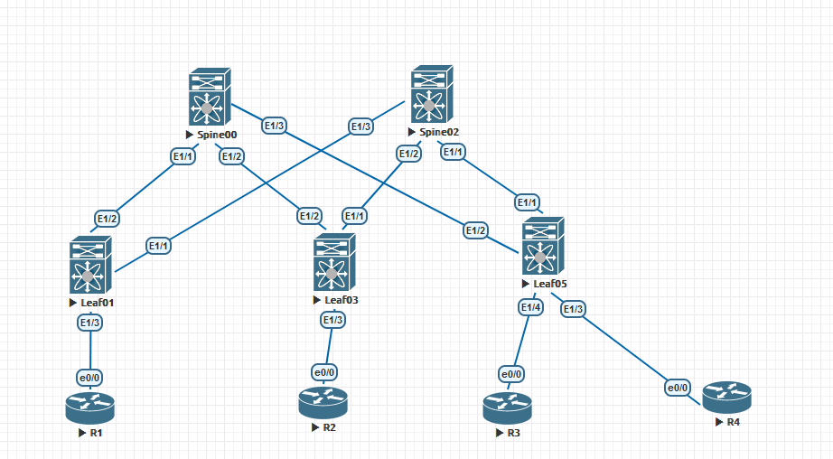

# OTUS - Дизайн сетей ЦОД
***
## LAB 02 - Построение Underlay сети(OSPF)

### -Цели
1. Настроить OSPF в Underlay сети, для IP связанности между всеми устройствами NXOS
2. План работы, адресное пространство, схема сети, настройки - зафиксированы в документации
Документация оформлена на github (markdown)

								Выполнение Работы
		
		
При выполнении работы использовался эмулятор сетевых устройств  Eve-NG 5.0.1-13. Были задействованы следующие образы:
- 	Nexus 9000v(nxos.7.0.3.I7.2.bin)
- 	Cisco IOL (L3-ADVENTERPRISEK9-M-15.4-2T.bin)
- 	
	
	###### * Рис 1. Топология сети*
	
	В данном случае, исходя из нашей небольшой топологии из 5 устройств лучшим вариантом будет настройть между ними OSPF,он имеет следующие преимущества:

+ Доставка маршрутной информации
+ Быстрая сходимость
+ Масштабируемость
+ Поддержка большого количества префиксов
+ Мультипротокольное испольование
+ Распределение балансироваки
+ Простота обслуживания
+ Удобство автоматизации

Все наши устройства будут в одной OSPF Backbone зоне,между ними P2P линки во избежании выборов DR/BDR,также настроены доп.опции(authentication,passive interfaces and etc.)

Router ID будет выбираться по следующему алгоритму:

X.Y.Z.A,где:

- X - Номер площадки;
- Y -  Зарезервировано под нужды;
- Z - Зарезервировано под нужды;
- A - Значение равное порядковому номеру ноды.

Т.е. Router ID  будет равен:

Spine00: 1.0.0.0

Leaf 03: 1.0.0.3 

и т.д.

#### Конфигурация

В нашей топологии в конфигурации OSPF будет настроено:
- Ручная настройка Router ID
- BFD
- Passive-interface default
- Authentication
- OSPF type interface p2p

Общая конфигурация OSPF на всех устройствах будет иметь следующий вид:

	NodeXX:
			feature ospf
			feature bfd
			bfd interval 300 min_rx 300 multiplier 5
			router ospf 1
				router-id X.X.X.X
				passive-interface default
				bfd
			interface X/X:
				ip ospf network point-to-point
				ip router ospf 1 area 0	
				ip ospf authentication-key X
				ip ospf bfd
				no ip ospf passive-interface
			interface loX:
				ip router ospf 1 area 0
		

Далее представлена таблица содержащая OSPF информацию о нодах в нашей лаборатории:
| Сетевое ус-во | Router id | Enabled interfaces |
| --- | --- | --- |
| Spine00 | 1.0.0.0 | Lo0 |
| Spine00 | 1.0.0.0 | Lo1 |
| Spine00 | 1.0.0.0 |Eth 1/1(Leaf01) |
| Spine00 | 1.0.0.0 |Eth 1/2(Leaf03)|
| Spine00 | 1.0.0.0 | Eth 1/3(Leaf05) |
| Spine02 | 1.0.0.2 | Lo1 |
| Spine02 | 1.0.0.2 | Lo0 |
| Spine02 | 1.0.0.2 | Eth 1/1(Leaf05) |
| Spine02 | 1.0.0.2 | Eth 1/2(Leaf03) |
| Spine02 | 1.0.0.2 | Eth 1/3(Leaf01)|
| Leaf01 | 1.0.0.1 | Lo0 |
| Leaf01 | 1.0.0.1 | Lo0 |
| Leaf01 | 1.0.0.1 | Eth 1/1(Spine02) |
| Leaf01 | 1.0.0.1 | Eth 1/2(Spine00) |
| Leaf03 | 1.0.0.3 | Lo0 |
| Leaf03 | 1.0.0.3 | Lo0 |
| Leaf03 | 1.0.0.3 | Eth 1/1(Spine02) |
| Leaf03 | 1.0.0.3 | Eth 1/2(Spine00) |
| Leaf05 | 1.0.0.5 | Lo0 |
| Leaf05 | 1.0.0.5 | Lo0 |
| Leaf05 | 1.0.0.5 | Eth 1/1(Spine02) |
| Leaf05 | 1.0.0.5 | Eth 1/2(Spine00) |

#### Настроим наши устройства:
	Spine00:
		feature ospf
		feature bfd
		bfd interval 300 min_rx 300 multiplier 5

		router ospf 1
			router-id 1.0.0.0
			passive-interface default
			bfd
		interface e 1/1
			ip ospf network point-to-point
			ip router ospf 1 area 0	
			ip ospf authentication-key cisco123
			ip ospf bfd
			no ip ospf passive-interface
		interface e 1/2
			ip ospf network point-to-point
			ip router ospf 1 area 0	
			ip ospf authentication-key cisco123
			ip ospf bfd
			no ip ospf passive-interface	
		interface e 1/3
			ip ospf network point-to-point
			ip router ospf 1 area 0	
			ip ospf authentication-key cisco123
			ip ospf bfd
			no ip ospf passive-interface
			
		interface lo0
		ip router ospf 1 area 0	
		interface lo1
		ip router ospf 1 area 0	
	Spine02:
		feature ospf
		feature bfd
		bfd interval 300 min_rx 300 multiplier 5

		router ospf 1
			router-id 1.0.0.2
			passive-interface default
			bfd
		interface e 1/1
			ip ospf network point-to-point
			ip router ospf 1 area 0	
			ip ospf authentication-key cisco123
			ip ospf bfd
			no ip ospf passive-interface
		interface e 1/2
			ip ospf network point-to-point
			ip router ospf 1 area 0	
			ip ospf authentication-key cisco123
			ip ospf bfd
			no ip ospf passive-interface	
		interface e 1/3
			ip ospf network point-to-point
			ip router ospf 1 area 0	
			ip ospf authentication-key cisco123
			ip ospf bfd
			no ip ospf passive-interface
			
		interface lo0
		ip router ospf 1 area 0	
		interface lo1
		ip router ospf 1 area 0	
	Leaf01:
		feature ospf
		feature bfd
		bfd interval 300 min_rx 300 multiplier 5

		router ospf 1
			router-id 1.0.0.1
			passive-interface default
			bfd
		interface e 1/1
			ip ospf network point-to-point
			ip router ospf 1 area 0	
			ip ospf authentication-key cisco123
			ip ospf bfd
			no ip ospf passive-interface
		interface e 1/2
			ip ospf network point-to-point
			ip router ospf 1 area 0	
			ip ospf authentication-key cisco123
			ip ospf bfd
			no ip ospf passive-interface	
		interface lo0
		ip router ospf 1 area 0	
		interface lo1
		ip router ospf 1 area 0	
	Leaf03:
		feature ospf
		feature bfd
		bfd interval 300 min_rx 300 multiplier 5
		router ospf 1
			router-id 1.0.0.3
			passive-interface default
			bfd
		interface e 1/1
			ip ospf network point-to-point
			ip router ospf 1 area 0	
			ip ospf authentication-key cisco123
			ip ospf bfd
			no ip ospf passive-interface
		interface e 1/2
			ip ospf network point-to-point
			ip router ospf 1 area 0	
			ip ospf authentication-key cisco123
			ip ospf bfd
			no ip ospf passive-interface	
		interface lo0
		ip router ospf 1 area 0	
		interface lo1
		ip router ospf 1 area 0	
	Leaf05:
		feature ospf
		feature bfd
		bfd interval 300 min_rx 300 multiplier 5
		router ospf 1
			router-id 1.0.0.5
			passive-interface default
			bfd
		interface e 1/1
			ip ospf network point-to-point
			ip router ospf 1 area 0	
			ip ospf authentication-key cisco123
			ip ospf bfd
			no ip ospf passive-interface
		interface e 1/2
			ip ospf network point-to-point
			ip router ospf 1 area 0	
			ip ospf authentication-key cisco123
			ip ospf bfd
			no ip ospf passive-interface	
		interface lo0
		ip router ospf 1 area 0	
		interface lo1
		ip router ospf 1 area 0	
	
Посмотрим включенные OSPF интерфейсы для проверки примененной конфигурации и построенные OSPF соседства на Spine01 и Spine02:

###### * sh ip ospf int br - Spine00*

###### * sh ip ospf neigh - Spine00*

###### * sh ip ospf int br -Spine02*

###### * sh ip ospf neigh - Spine02*

Как видим нужные нам интерфейсы задействованы в OSPF процессе и на них построены соседства, типы интерфейсов соответствуют задаче.
*Конфигурация устройств*

1. [Spine00](Spine00.conf)
2. [Spine02](Spine02.conf)
3. [Leaf01](Leaf01.conf)
4. [Leaf03](Leaf03.conf)
5. [Leaf05](Leaf05.conf)

#### На этом лабораторную работу №2 считаю завершенной
