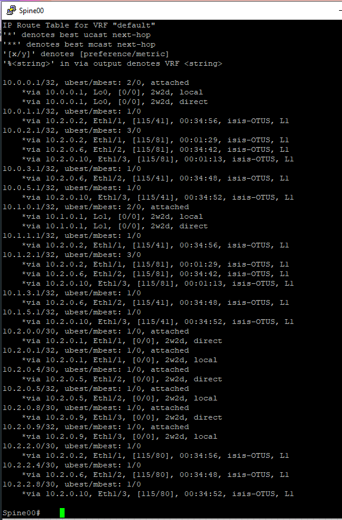

# OTUS - Дизайн сетей ЦОД
***
## LAB 03 - Построение Underlay сети(IS-IS)

### -Цели
1. Настроить IS-IS в Underlay сети, для IP связанности между всеми устройствами NXOS
2. План работы, адресное пространство, схема сети, настройки - зафиксированы в документации
Документация оформлена на github (markdown)

				Выполнение Работы
		
		
При выполнении работы использовался эмулятор сетевых устройств  Eve-NG 5.0.1-13. Были задействованы следующие образы:
- 	Nexus 9000v(nxos.7.0.3.I7.2.bin)
- 	Cisco IOL (L3-ADVENTERPRISEK9-M-15.4-2T.bin)
- 	
	
	###### * Рис 1. Топология сети*
	
	В данном случае, исходя из нашей задачи нам необходимо настроить динамический протокол маршрутизации типа Link-State IS-IS,он имеет следующие преимущества:

+ Использует алгоритм Дейкстры поиска кратчайшего пути; 
+ Быстрая сходимость;
+ Поддержка VLSM;
+ Использует hello-пакеты для установления отношений соседства и link-state пакеты для обмена информацией о состоянии каналов ;
+ Эффективное использование пропускной способности, памяти и процессора ;
+ Поддерживает два уровня маршрутизации: 
	* Уровень 1: маршрутизация внутри зоны IS-IS. Протокол распознает местоположение ES и IS, а после этого строит таблицу маршрутизации для достижения каждой системы. У всех устройств в зоне маршрутизации Уровня 1 одинаковые адреса зоны. Маршрутизация внутри зоны выполняется с учетом значения locally significant address portion (system ID) и выбора кратчайшего пути. 
	* Уровень 2: маршрутизаторы на этом уровне определяют местоположение зон уровня 1 и строят таблицу маршрутизации между зонами. Все IS в зоне маршрутизации Уровня 2 используют адрес зоны назначения для того, чтобы отправить данные используя кратчайший путь. 

По сравнению с OSPF имеет следующие преимущества:
+ Более масштабируем, чем OSPF
+ Большая скорость сходимости сети

Т.к. в нашей топологии всего 5 сетевых устройств,то разносить их по разным зонам не имеет смысла, это только усложнит конфигурацию и будущее ее чтение,понимание.
Будем их настраивать в одной зоне.

Настройка зоны будет иметь следующий формат:

47.1000.1000.1000.000

Где:

47 - установленное значение по умолчанию протокола IS-IS

xxxx - area ID,для площадки 1 значение будет равно 1000,площадка 2 = +1000(2000) и т.д.

yyyy - идентификатор системы, значение будет равно 1000, увеличиваем также как и xxxx в зависимости от площадки

N - порядковый номер сетевого устройства

a/b  - где если a = Spine, b = Leaf

Например:

47.1000.1000.1000.100a.00 - Spine 00

47.1000.1000.1000.101b.00 - Leaf 01

47.1000.1000.1000.103b.00 - Leaf 03

47.1000.1000.1000.104a.00 - Spine 04

#### Конфигурация

Сперва включим на Cisco Nexus опцию использования протокола ISIS и BFD:

	feature isis

Создадим инстанс протокола и укажем AREA ID

	router isis OTUS
		net 47.1000.1000.1000.000a.00
		

По-умолчанию тип зоны в IS-IS установлен как 1-2,нам это подходит,т.к. в нашей топологии используется в данный момент только одна зона ,но в будущем из-за масштабируемости сети возможно нам придется настраивать и соседства на уровне 2, пропишем на всякий случай: 

Установим зону ISIS 1-2:

	is-type level-1-2

Также настроим на наших устройства аутентификацию 

	key chain ISISKey
		key 1
			key-string isiskeyforOTUS
	router isis OTUS
			 authentication-type md5 level-1
			 authentication-type md5 level-2
			 authentication key-chain ISISKey level-1
			 authentication key-chain ISISKey level-2

Настройка на интерфейсе:

	ip router isis OTUS
	isis circuit-type level-1-2
		

На этом наша базовая конфигурация завершена,в данной лаборатории,к сожалению,  настройку BFD осуществить не удалось из-за неработоспособности в эмуляторе EVE-NG

Далее представлена таблица содержащая ISIS информацию о нодах в нашей лаборатории

| Сетевое ус-во | Router id | Enabled interfaces |
| --- | --- | --- |
| Spine00 | 47.1000.1000.1000.000a.00 | Lo0 |
| Spine00 | 47.1000.1000.1000.000a.00 | Lo1 |
| Spine00 | 47.1000.1000.1000.000a.00 |Eth 1/1(Leaf01) |
| Spine00 | 47.1000.1000.1000.000a.00 |Eth 1/2(Leaf03)|
| Spine00 | 47.1000.1000.1000.000a.00 | Eth 1/3(Leaf05) |
| Spine02 | 47.1000.1000.1000.002a.00 | Lo1 |
| Spine02 | 47.1000.1000.1000.002a.00 | Lo0 |
| Spine02 | 47.1000.1000.1000.002a.00 | Eth 1/1(Leaf05) |
| Spine02 | 47.1000.1000.1000.002a.00 | Eth 1/2(Leaf03) |
| Spine02 | 47.1000.1000.1000.002a.00 | Eth 1/3(Leaf01)|
| Leaf01 | 47.1000.1000.1000.001b.00 | Lo0 |
| Leaf01 | 47.1000.1000.1000.001b.00 | Lo0 |
| Leaf01 | 47.1000.1000.1000.001b.00 | Eth 1/1(Spine02) |
| Leaf01 | 47.1000.1000.1000.001b.00 | Eth 1/2(Spine00) |
| Leaf03 | 47.1000.1000.1000.003b.00 | Lo0 |
| Leaf03 | 47.1000.1000.1000.003b.00 | Lo0 |
| Leaf03 | 47.1000.1000.1000.003b.00 | Eth 1/1(Spine02) |
| Leaf03 | 47.1000.1000.1000.003b.00 | Eth 1/2(Spine00) |
| Leaf05 | 47.1000.1000.1000.005b.00 | Lo0 |
| Leaf05 | 47.1000.1000.1000.005b.00 | Lo0 |
| Leaf05 | 47.1000.1000.1000.005b.00 | Eth 1/1(Spine02) |
| Leaf05 | 47.1000.1000.1000.005b.00 | Eth 1/2(Spine00) |

#### Настроим наши устройства:
	Spine00:
		feature isis
		key chain ISISKey
			key 1
				key-string isiskeyforOTUS
		router isis OTUS
			net 47.1000.1000.1000.000a.00
			is-type level-1-2
			authentication-type md5 level-1
			authentication-type md5 level-2
			authentication key-chain ISISKey level-1
			authentication key-chain ISISKey level-2
		int e 1/1
			isis circuit-type level-1-2
  			ip router isis OTUS
		int e 1/2
			ip router isis OTUS
			isis circuit-type level-1-2
		int e 1/3
			ip router isis OTUS
			isis circuit-type level-1-2
		int lo0
			ip router isis OTUS
			isis circuit-type level-1-2
		int lo1
			ip router isis OTUS
			isis circuit-type level-1-2

	Spine02:
		feature isis
		key chain ISISKey
			key 1
				key-string isiskeyforOTUS
		router isis OTUS
			net 47.1000.1000.1000.002a.00
			is-type level-1-2
			authentication-type md5 level-1
			authentication-type md5 level-2
			authentication key-chain ISISKey level-1
			authentication key-chain ISISKey level-2
		int e 1/1
			isis circuit-type level-1-2
  			ip router isis OTUS
		int e 1/2
			ip router isis OTUS
			isis circuit-type level-1-2
		int e 1/3
			ip router isis OTUS
			isis circuit-type level-1-2
		int lo0
			ip router isis OTUS
			isis circuit-type level-1-2
		int lo1
			ip router isis OTUS
			isis circuit-type level-1-2
	
	Leaf01:
			feature isis
		key chain ISISKey
			key 1
				key-string isiskeyforOTUS
		router isis OTUS
			net 47.1000.1000.1000.001b.00
			is-type level-1-2
			authentication-type md5 level-1
			authentication-type md5 level-2
			authentication key-chain ISISKey level-1
			authentication key-chain ISISKey level-2
		int e 1/1
			isis circuit-type level-1-2
  			ip router isis OTUS
		int e 1/2
			ip router isis OTUS
			isis circuit-type level-1-2
		int lo0
			ip router isis OTUS
			isis circuit-type level-1-2
		int lo1
			ip router isis OTUS
			isis circuit-type level-1-2
	
	Leaf03:
			feature isis
		key chain ISISKey
			key 1
				key-string isiskeyforOTUS
		router isis OTUS
			net 47.1000.1000.1000.003b.00
			is-type level-1-2
			authentication-type md5 level-1
			authentication-type md5 level-2
			authentication key-chain ISISKey level-1
			authentication key-chain ISISKey level-2
		int e 1/1
			isis circuit-type level-1-2
  			ip router isis OTUS
		int e 1/2
			ip router isis OTUS
			isis circuit-type level-1-2
		int lo0
			ip router isis OTUS
			isis circuit-type level-1-2
		int lo1
			ip router isis OTUS
			isis circuit-type level-1-2
	
	Leaf05:
				feature isis
		key chain ISISKey
			key 1
				key-string isiskeyforOTUS
		router isis OTUS
			net 47.1000.1000.1000.005b.00
			is-type level-1-2
			authentication-type md5 level-1
			authentication-type md5 level-2
			authentication key-chain ISISKey level-1
			authentication key-chain ISISKey level-2
		int e 1/1
			isis circuit-type level-1-2
  			ip router isis OTUS
		int e 1/2
			ip router isis OTUS
			isis circuit-type level-1-2
		int lo0
			ip router isis OTUS
			isis circuit-type level-1-2
		int lo1
			ip router isis OTUS
			isis circuit-type level-1-2
	

Теперь убедимся что соседство между устройствами установилось, топология построилась и обмен маршрутной информацией произошел.

###### Рис 1. Топология ISIS Spine00

###### Рис 2. Построенные соседства Spine00
		

###### Рис 3. RIB Table Spine 00

###### Рис 4. Топология ISIS Spine02

###### Рис 5. Построенные соседства Spine02

###### Рис 6. RIB Table Spine 02

Как видим все соседства успешно построены и устройства обменялись маршрутной информацией.Сетевая доступность хостов обеспечена.

#### На этом лабораторную работу №3 считаю завершенной
