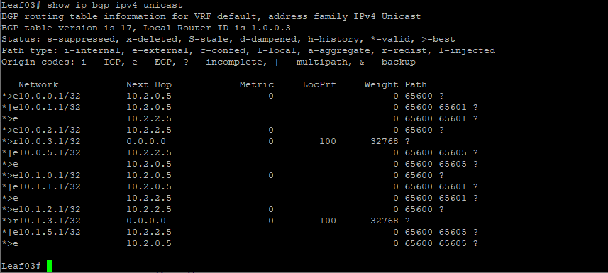
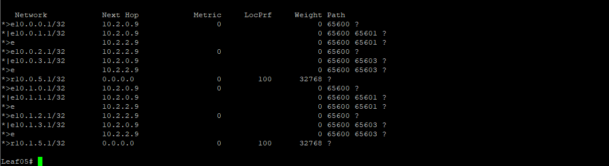

# OTUS - Дизайн сетей ЦОД
***
## LAB 04 - Построение Underlay сети(eBGP)

### -Цели
1. Настроить BGP в Underlay сети, для IP связанности между всеми устройствами NXOS
2. План работы, адресное пространство, схема сети, настройки - зафиксированы в документации
Документация оформлена на github (markdown)

				Выполнение Работы
		
		
При выполнении работы использовался эмулятор сетевых устройств  Eve-NG 5.0.1-13. Были задействованы следующие образы:
- 	Nexus 9000v(nxos.7.0.3.I7.2.bin)
- 	Cisco IOL (L3-ADVENTERPRISEK9-M-15.4-2T.bin)
- 	
	
	###### * Рис 1. Топология сети*
	
	В данном случае, исходя из нашей задачи нам необходимо настроить динамический протокол маршрутизации типа Path-Vector,семейства EGP,а именно eBGP

В нашей топологии CLOS был выбран именно eBGP,а не iBGP по следующим преимуществам:

- Имеет более простой механизм выбора пути
- eBGP проще в плане настройки узлов для поддержки ECMP
- Нет необходимости использовать RR, либо full-mesh топологию в случае iBGP

Т.к в нашей топологии 5 узлов,2-spine,3-leaf, автономные системы будут настроены по принципу: Spine коммутаторы - один номер ASN, Leaf  коммутаторы - свои уникальные ASN , так мы избежим случая с "Path Hunting" и избежим петли.

Как мы помним, для BGP Private ASN выделен определенный пул: с 64512 по 65534(2 байт ASN). Соответственно нумерация AS и Router ID будет основан, как и в предыдущих лабораторных работах на нумерацию самих сетевых устройств, т.е.:

Базовый ASN для нашей лаборатории : 64Xyy,
 где
 

    X - Номер площадки,начиная с 6;
    Y - Значение равное порядковому номеру ноды.
    Y - Значение равное порядковому номеру ноды.(0 в случае Spine)

Т.е. ASN будет равен:

Spine00: 64600

Spine02: 64600
 
Leaf01: 64601

Leaf03: 64603

Leaf05: 64605

Router ID будет выбираться по следующему алгоритму:

X.Y.Z.A,где:

    X - Номер площадки;
    Y - Зарезервировано под нужды;
    Z - Зарезервировано под нужды;
    A - Значение равное порядковому номеру ноды.

Т.е. Router ID будет равен:

Spine00: 1.0.0.0

Spine02: 1.0.0.2

Leaf 01: 1.0.0.1
 
Leaf03: 1.0.0.3

Leaf05: 1.0.0.5

#### Конфигурация

В нашей конфигурации относительно базовой(дефолнтой) мы применим:

- Изменим более агрессивно таймеры

		• Advertisement interval timer = 1 sec (default eBGP 30 sec)
		
		• Keepalive Timer = 3 sec (default 60 sec)
		
		• Hold Timer = 9 sec (default 180 sec)
		

- Maximum-path установим в 64 
- Применим bestpath as-path multipath-relax
- Будем использовать редистрибьюцию и route-map при анонсе локальных префиксов на Leaf коммутаторах

Далее приведем шаблон конфигурации BGP  на примере *Spine00:*

Сперва включим на Cisco Nexus опцию использования протокола BGP

	feature bgp

Создадим route-map для редестрибьюции connected сетей и гибкого управления маршрутами,инстанс протокола и укажем AREA ID, укажем доп.опции и создадим соседства

	
	route-map REDISTRIBUTE_CONNECTED permit 10
		match interface lo0
		match interface lo1
	router bgp 65600
		router-id 1.0.0.0
			bestpath as-path multipath-relax
			address-family ipv4 unicast
			redistribute direct route-map REDISTRIBUTE_CONNECTED
			maximum-paths 64
			neighbour 10.2.0.2
				remote-as 65601		
				timers 3 9
				address-family ipv4 unicast
					advertisement-interval 1
			neighbour 10.2.0.4
				remote-as 65602		
				timers 3 9
				address-family ipv4 unicast
					advertisement-interval 1
			neighbour 10.2.0.6
				remote-as 65603		
				timers 3 9
				address-family ipv4 unicast
					advertisement-interval 1
			neighbour 10.2.0.10
				remote-as 65603		
				timers 3 9
				address-family ipv4 unicast
					advertisement-interval 1

Затем привдет шаблон конфигурации BGP на примере *Leaf05*

	feature bgp
	route-map REDISTRIBUTE_CONNECTED permit 10
		match interface lo0
		match interface lo1
	router bgp 65605
		router-id 1.0.0.5
			bestpath as-path multipath-relax
			reconnect-interval 12
			address-family ipv4 unicast
				redistribute direct route-map REDISTRIBUTE_CONNECTED
				maximum-paths 64
		template peer SPINES
			remote-as 65600
			timers 3 9
			address-family ipv4 unicast
		neighbor 10.2.0.9
			inherit peer SPINES
			description SPINE00
		neighbor 10.2.2.9
			inherit peer SPINES
			description SPINE02
			

Шаблон конфигураций устройств готов,приведем сводную информационную таблицу,содержащую BGP информацию на устройствах
| Сетевое ус-во | Router id | Area ID | Redistributed interfaces |
| --- | --- | --- | --- |
| Spine00 | 1.0.0.0 | 65600 | Lo0 |
| Spine00 | 1.0.0.0 | 65600 | Lo1 |
| Spine02 | 1.0.0.2 | 65600 | Lo0 |
| Spine02 | 1.0.0.2 | 65600 | Lo1 |
| Leaf01 | 1.0.0.1| 65601  |Lo0 |
| Leaf01 | 1.0.0.1| 65601 | Lo1|
| Leaf03 | 1.0.0.3| 65603 | Lo0 |
| Leaf03 | 1.0.0.3|  65603 | Lo1 |
| Leaf05 | 1.0.0.5 | 65605 | Lo0 |
| Leaf05 | 1.0.0.5 | 65605 | Lo1 |

Далее приведена конфигурация всех устройств

#### Настроим наши устройства:
	Spine00:
		feature bgp
		router bgp 65600
	  	router-id 1.0.0.0
	  	bestpath as-path multipath-relax
	  	address-family ipv4 unicast
	  		maximum-paths 64
	  	neighbor 10.2.0.2
			remote-as 65601
			timers 3 9
			address-family ipv4 unicast
				advertisement-interval 1
		neighbor 10.2.0.6
			remote-as 65603
			timers 3 9
			address-family ipv4 unicast
				advertisement-interval 1
		neighbor 10.2.0.10
			remote-as 65605
			timers 3 9
			address-family ipv4 unicast
				advertisement-interval 1
	Spine02:
		feature bgp
		router bgp 65600
		router-id 1.0.0.2
		bestpath as-path multipath-relax
		address-family ipv4 unicast
			maximum-paths 64
  		neighbor 10.2.2.2
			remote-as 65601
			timers 3 9
			address-family ipv4 unicast
				advertisement-interval 1
		neighbor 10.2.2.6
			remote-as 65603
			timers 3 9
			address-family ipv4 unicast
				advertisement-interval 1
		neighbor 10.2.2.10
		remote-as 65605
		timers 3 9
		address-family ipv4 unicast
			advertisement-interval 1
	Leaf01:
	feature bgp
		router bgp 65601
			router-id 1.0.0.1
			bestpath as-path multipath-relax
			reconnect-interval 12
			address-family ipv4 unicast
				redistribute direct route-map REDISTRIBUTE_CONNECTED
				maximum-paths 64
		template peer SPINES
			remote-as 65600
			timers 3 9
			address-family ipv4 unicast
		neighbor 10.2.0.1
			inherit peer SPINES
			description SPINE00
		neighbor 10.2.2.1
			inherit peer SPINES
			description SPINE02
	Leaf03:
		feature bgp
		router bgp 65603
			router-id 1.0.0.3
			bestpath as-path multipath-relax
			reconnect-interval 12
			address-family ipv4 unicast
				redistribute direct route-map REDISTRIBUTE_CONNECTED
				maximum-paths 64
			template peer SPINES
				remote-as 65600
				timers 3 9
				address-family ipv4 unicast
			neighbor 10.2.0.5
				inherit peer SPINES
				description SPINE00
			neighbor 10.2.2.5
				inherit peer SPINES
				description SPINE02
	Leaf05:
			feature bgp
			router bgp 65605
				router-id 1.0.0.5
				bestpath as-path multipath-relax
				reconnect-interval 12
			address-family ipv4 unicast
				redistribute direct route-map REDISTRIBUTE_CONNECTED
				maximum-paths 64
			template peer SPINES
				remote-as 65600
				timers 3 9
				address-family ipv4 unicast
			neighbor 10.2.0.9
				inherit peer SPINES
				description SPINE00
			neighbor 10.2.2.9
				inherit peer SPINES
				description SPINE02
	

Теперь убедимся что соседство между устройствами установилось, топология построилась и обмен маршрутной информацией произошел.

Посмотрим соседей на Spine00 и на Spine02:

###### Рис 1. Соседство BGP Spine00

###### Рис 2. Соседство BGP Spine02

Затем посмотрим итоговые маршруты на наших устройствах:

		

###### Рис 3. BGP table Spine00

###### Рис 4. BGP table Spine02

###### Рис 5. BGP table Leaf01

###### Рис 5. BGP table Leaf03

###### Рис 5. BGP table Leaf05

Как видим все соседства успешно построены и устройства обменялись маршрутной информацией.Сетевая доступность хостов обеспечена.

#### На этом лабораторную работу №3 считаю завершенной
