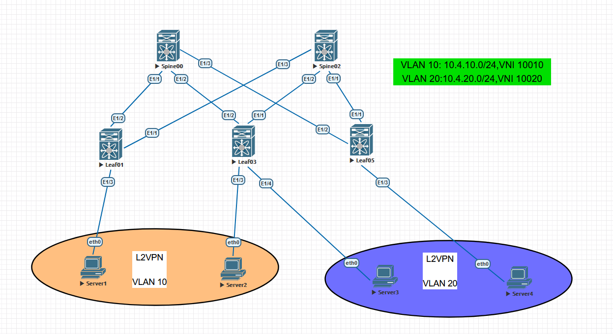
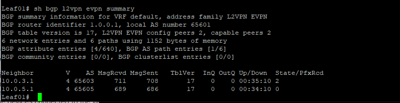
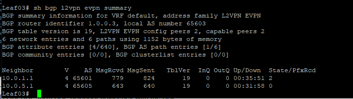
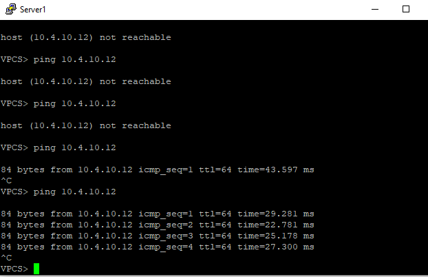
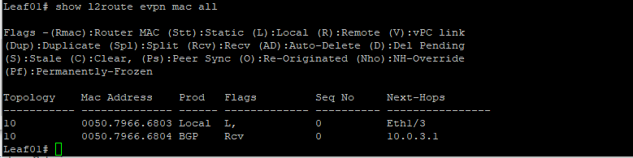
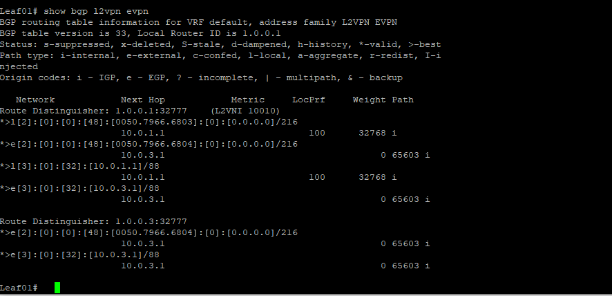
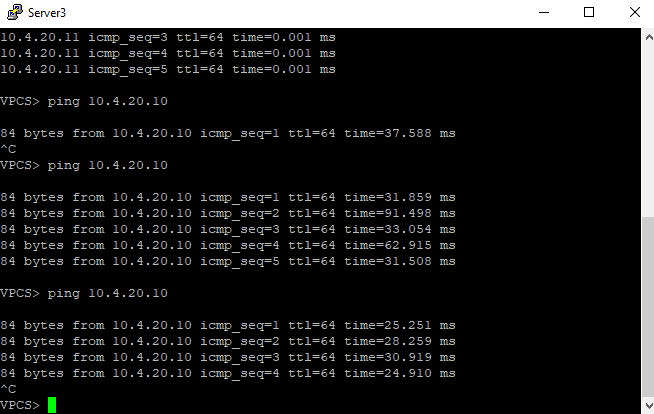
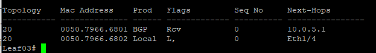
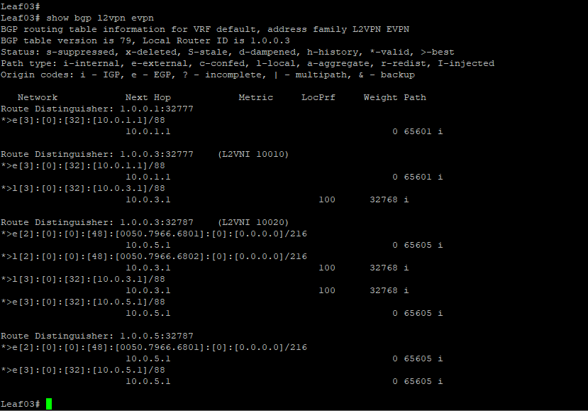

# OTUS - Дизайн сетей ЦОД
***
## LAB 05 - VXLAN EVPN L2

### -Цели
1. Настроить BGP peering между Leaf и Spine в AF l2vpn evpn
2. Настроена связанность между клиентами в первой зоне
3. План работы, адресное пространство, схема сети, настройки - зафиксированы в документации

				Выполнение Работы
		
		
При выполнении работы использовался эмулятор сетевых устройств  Eve-NG 5.0.1-13. Были задействованы следующие образы:
- 	Nexus 9000v(nxos.7.0.3.I7.2.bin)
- 	Cisco IOL (L3-ADVENTERPRISEK9-M-15.4-2T.bin)

Топология сети выглядит следующим образом:
	
	###### * Рис 1. Топология сети*
	
Данная работа логически разбита на 3 части:
- Описательная, где есть вводная часть работы и пояснение по выполнению
- Настройка Overlay сети на базе eBGP
- Настройка VXLAN EVPN L2

Адресация хостов выбирается по методу описанному в  лабораторной работе  №1
Адресация интерфейсов сетевого оборудования уже была настроена в лабораторной работе 1

Номер VNI образуется путем добавления числа "100" к номеру Vlan

Исходя из этого получается, что:

| Хост | IP | Vlan | VNI | Interface |
| --- | --- | --- | --- | --- |
| Server4 | 10.4.20.10 |20|10020 | Leaf05-E1/3 |
| Server3| 10.4.20.11 | 20 |10020| Leaf03-E1/4 |
| Server2 | 10.4.10.10 | 10 |10010| Leaf03-E1/3 |
| Server1 | 10.4.10.11 | 10 |10010| Leaf01-E1/3 |

В данном случае, исходя из нашей задачи нам необходимо настроить сетевую L2 связанность между хостами, подключенных к разным сетевым устройствам  разделенных через  L3 домен. Для этого воспользуемся помощью технологии VXLAN+EVPN L2(Vlan Based Service)
Это позволить нам добиться следующих преимуществ:
- Простота масштабирования
- Гибкость
- Мобильность MAC адресов
- Не сложная конфигурация
- У каждого VLAN свой MAC-VRF(свои RD/RT)(N:N) (Преимущество Vlan Based Service)
- Для каждого VLAN своя Bridge Table (Преимущество Vlan Based Service)
- Ethernet Tag = 0 (Преимущество Vlan Based Service)

Ранее мы настраивали(Лабораторная работа №4) Underlay связанность между намиши устройствами с помощью eBGP,

В нашей топологии CLOS был выбран именно eBGP,а не iBGP по следующим преимуществам:

- Имеет более простой механизм выбора пути
- eBGP проще в плане настройки узлов для поддержки ECMP
- Нет необходимости использовать RR, либо full-mesh топологию в случае iBGP

Т.к в нашей топологии 5 узлов,2-spine,3-leaf, автономные системы будут настроены по принципу: Spine коммутаторы - один номер ASN, Leaf  коммутаторы - свои уникальные ASN , так мы избежим случая с "Path Hunting" и избежим петли.

Как мы помним, для BGP Private ASN выделен определенный пул: с 64512 по 65534(2 байт ASN). Соответственно нумерация AS и Router ID будет основан, как и в предыдущих лабораторных работах на нумерацию самих сетевых устройств, т.е.:

Базовый ASN для нашей лаборатории : 64Xyy,
 где
 

    X - Номер площадки,начиная с 6;
    Y - Значение равное порядковому номеру ноды.
    Y - Значение равное порядковому номеру ноды.(0 в случае Spine)

Т.е. ASN будет равен:

Spine00: 64600

Spine02: 64600
 
Leaf01: 64601

Leaf03: 64603

Leaf05: 64605

Router ID будет выбираться по следующему алгоритму:

X.Y.Z.A,где:

    X - Номер площадки;
    Y - Зарезервировано под нужды;
    Z - Зарезервировано под нужды;
    A - Значение равное порядковому номеру ноды.

Т.е. Router ID будет равен:

Spine00: 1.0.0.0

Spine02: 1.0.0.2

Leaf 01: 1.0.0.1
 
Leaf03: 1.0.0.3

Leaf05: 1.0.0.5

#### Конфигурация

#### Настройка Overlay-eBGP

Первым шагом для реализации VXLAN нам необходима L3 связанность на уровне Overlay,в этом как и для Underlay нам поможет eBGP, все исходные данные можно посмотреть в описательной части этой работы.
Соседства будут строиться на Loopback0 интерфейсах с измененными в меньшую сторону таймерами,общая конфигурация будет иметь вид:

	
Общая конфигурация Leaf:

	nv overlay evpn(Включаем фичу evpn)
	router bgp X
		neighbor X(Указываем Lo0 Leafs)
			remote-as X
			update-source loopback0
			ebgp-multihop 2
			timers 3 9
			address-family l2vpn evpn
				send-community extended
				send-community
Применим конфигурацию на Leaf05,03,01

 	
 	Leaf01:
 	nv overlay evpn
	router bgp 65601
	
	neighbor 10.0.3.1
		remote-as 65603
		update-source loopback0
		ebgp-multihop 2
		timers 3 9
		address-family l2vpn evpn
			send-community
			send-community extended
	neighbor 10.0.5.1
			remote-as 65605
		update-source loopback0
		ebgp-multihop 2
		timers 3 9
		address-family l2vpn evpn
			send-community
			send-community extended
	Leaf03
	nv overlay evpn
	router bgp 65601
	
	neighbor 10.0.1.1
	    remote-as 65601
	    update-source loopback0
	    ebgp-multihop 2
	    timers 3 9
	    address-family ipv4 unicast
	    address-family l2vpn evpn
			send-community
			send-community extended
	neighbor 10.0.5.1
		remote-as 65605
		update-source loopback0
		ebgp-multihop 2
		timers 3 9
		address-family l2vpn evpn
			send-community
			send-community extended
	 Leaf05
	 nv overlay evpn
	router bgp 65606
	
	neighbor 10.0.1.1
	    remote-as 65601
	    update-source loopback0
	    ebgp-multihop 2
	    timers 3 9
	    address-family ipv4 unicast
	    address-family l2vpn evpn
			send-community
			send-community extended
	neighbor 10.0.3.1
		remote-as 65603
		update-source loopback0
		ebgp-multihop2
		timers 3 9
		address-family l2vpn evpn
			send-community
			send-community extended
	 
И проверим теперь установленные eBGP L2VPN соседства на Leaf01 и Leaf03:

###### * Рис 1. Leaf01 l2vpn summary*

###### * Рис 1. Leaf03 l2vpn summary*

Как видим все в порядке,проблем не возникло,соседства установлены. Перейдем к настройке VXLAN EVPN L2.

#### Настройка VXLAN EVPN L2

Сперва нам необходимо включить фичи для работы технологии VxLAN и возможность ассоциировать номера VLAN с номером VNI:

	feature nv overlay
	feature vn-segment-vlan-based

Настроим интерфейс NVE, который отвечает за работу VxLAN. Данный интерфейс как раз и отвечает за инкапсуляцию кадров в VxLAN заголовки. Можно провести аналогию с Tunnel интерфейсом для работы GRE:

	interface nve1
	no shutdown
	host-reachability protocol bgp
	source-interface loopback0

Создадим vlan's и привяжем их к VNI(VxLAN Network Identifier),настроим туннель между сетевыми устройствами

	vlan 10
	vn-segment 10000 
	vlan 20
	vn-segment 10020
 
	interface nve1
	member vni 10000
	ingress-replication protocol bgp
 
 Настроим передачу EVPN Route-type 2:
 
 	evpn
 	vni 10010 l2
    rd auto
    route-target import 65603:10010
    route-target export 65601:10010
 	
	
Общая конфигурация приведена ниже:
	
	Leaf01
		feature nv overlay
		feature vn-segment-vlan-based
		interface nve1
			no shutdown
			host-reachability protocol bgp
			source-interface loopback0
			member vni 10010
    			ingress-replication protocol bgp
		vlan 10
			name Segment1
			vn-segment 10010
		evpn
	 		vni 10010 l2
			    rd auto
			    route-target import 65603:10010
			    route-target export 65601:10010
	*В данном случае Vni 10020 не требуется*
		
	Leaf03
		feature nv overlay
		feature vn-segment-vlan-based
		interface nve1
			no shutdown
			host-reachability protocol bgp
			source-interface loopback0
			member vni 10010
				ingress-replication protocol bgp
			member vni 10020
				ingress-replication protocol bgp
		vlan 10
			name Segment1
			vn-segment 10010
		vlan 20
			name Segment2
			vn-segment 10020
		evpn
			vni 10010 l2
				rd auto
				route-target import 65601:10010
				route-target export 65603:10010
			vni 10020 l2
				rd auto
				route-target import 65605:10020
				route-target export 65603:10020
	Leaf05
		feature nv overlay
		feature vn-segment-vlan-based
		interface nve1
			no shutdown
			host-reachability protocol bgp
			source-interface loopback0
			member vni 10020
    			ingress-replication protocol bgp
		vlan 20
			name Segment2
			vn-segment 10020
		evpn
			vni 10020 l2
				rd auto
			    route-target import 65603:10020
			    route-target export 65605:10020
	*В данном случае Vni 10010 не требуется*
				
	

Настройка на этом должна быть завершена,попробуем протестировать ICMP Requests/Echoes 

Server1-Server2/(vlan10)
Server3-Server4(vlan20)

 и посмотреть выводы информативных команд
 
 Как видим доступность от Server1 до Server2 имеется,что не может не радовать
 

###### Рис 1. ICMP response Server1

Посмотрим таблицу l2vpn мак-адресов и увидим что мак-адрес Server2 приходит по BGP со стороны Leaf03

###### Рис 2. show l2route evpn mac all

То же самое подтверждает таблица маршрутизации l2vpn EVPN Leaf01

###### Рис 3. L2vpn routing table

По-моему здесь ничего не вызывает подозрений,посмотрим теперь сетевую доступность Server3-4(vlan 20)

 Как видим доступность от Server3 также имеется
 

###### Рис 1. ICMP response Server3

Посмотрим таблицу l2vpn мак-адресов и увидим что мак-адрес Server4 приходит по BGP со стороны Leaf05

###### Рис 2. show l2route evpn mac all

То же самое подтверждает таблица маршрутизации l2vpn EVPN на Leaf03

###### Рис 3. L2vpn routing table

Как видим все соседства успешно настроены,underlay,overlay,EVPN L2 связанность обеспечена.

Конфигурация устройств

1. [Spine00](Spine00.conf)
2. [Spine02](Spine02.conf)
3. [Leaf01](Leaf01.conf)
4. [Leaf03](Leaf03.conf)
5. [Leaf05](Leaf05.conf)

#### На этом лабораторную работу №5 считаю завершенной
