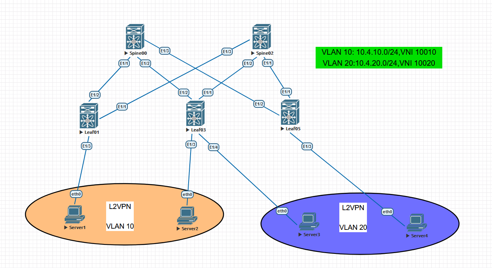
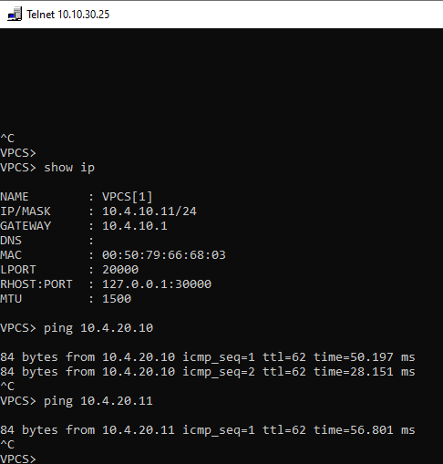
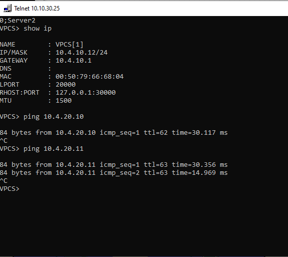
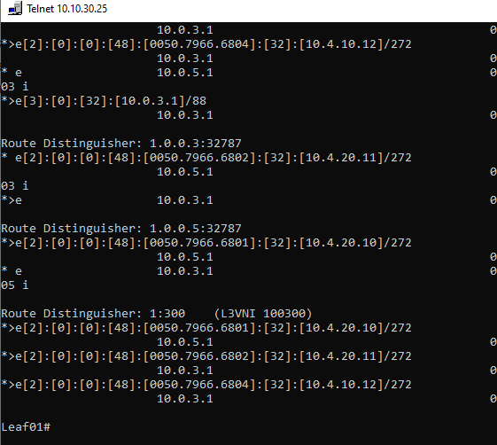
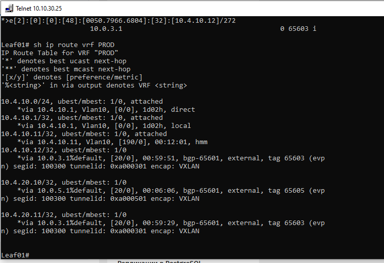

# OTUS - Дизайн сетей ЦОД
***
## LAB 06 - VXLAN EVPN L3

### -Цели
1. Настроите каждого клиента в своем VNI
2. Настроите маршрутизацию между клиентами
3. План работы, адресное пространство, схема сети, настройки - зафиксированы в документации

				Выполнение Работы
		
		
При выполнении работы использовался эмулятор сетевых устройств  Eve-NG 5.0.1-13. Были задействованы следующие образы:
- 	Nexus 9000v(nxos.7.0.3.I7.2.bin)
- 	Virtual PC(VPC)

Топология сети выглядит следующим образом:
	
	###### * Рис 1. Топология сети*
	
Адресация хостов выбирается по методу описанному в  лабораторной работе  №1

Адресация интерфейсов сетевого оборудования также уже была настроена в лабораторной работе № 1

Так же в работе 4 и 5 были настроены underlay eBGP и overlay eBGP,BGP EVPN L2,поэтому в данной лабораторной работе повторные настройки не связанные с VxLAN L3 описаны не будут.

Номер VNI образуется путем добавления числа "100" к номеру Vlan

Исходя из этого получается, что:

| Хост | IP | Vlan | VNI | Interface |
| --- | --- | --- | --- | --- |
| Server4 | 10.4.20.10 |20|10020 | Leaf05-E1/3 |
| Server3| 10.4.20.11 | 20 |10020| Leaf03-E1/4 |
| Server2 | 10.4.10.10 | 10 |10010| Leaf03-E1/3 |
| Server1 | 10.4.10.11 | 10 |10010| Leaf01-E1/3 |

В данном случае, исходя из нашей задачи нам необходимо настроить сетевую L3 связанность между хостами путем VxLAN EVPN L3.  Этого можно добиться двумя способами: Symmetric IRB(Integrated routing and bridging) and Assymetric IRB.

*Symmetric IRB:*
- Маршрутизация на ingress VTEP и на egress VTEP
- Симметричность - один L3VNI на разных направлениях одного потока
- Маршрутизация через IP-VRF, настройки VLAN-VNI не должны быть одинаковы на всех VTEP фабрики
- В одном IP-VRF может быть несколько MAC-VRF ( Общий L3VNI)
- Полноценный VRF

Плюсы:

- Лучше масштабируемость
- Проще интеграция с внешним миром

Минусы:
- Выше задержки ( TTL-2 )

*Assymetric IRB*  

- Маршрутизация на ingress VTEP
- На egress VTEP только коммутация
- Ассиметричность - разные VNI на разных направлениях одного потока
- На всех VTEP должны быть сконфигурированы все VLAN-VNI
- VRF-Lite

Плюсы:
- Низкая задержка (TTL-1)
- Простота конфигурации

Минусы:
- Плохая масштабируемость

 
В нашем случае более логично использовать симметричную схему,т.к. в нашей топологии на некоторых VTEP нет нужных VNI.

Давайте же приступим к настройке 
#### Конфигурация

Сперва создадим VRF для L3VPN,он важен в ссиметричной схеме,используется для маршрутизации между LEAF-устройствами.
Внутри для идентификации укажем RD, создадим внутри address-family,и экспортируем свои маршруты/импортируем от других LEAF

Номер RD выбирается исходя из нумерации устройства и номера влана отвечающего за маршрутизацию в VRF,т.е:

Leaf01 - 1:300

Leaf03 - 3:300

Leaf05 - 5:300

Конфигурация приведена на примере LEAF01

	vrf context PROD
		vni 100300 
		rd 1:300
		address-family ipv4 unicast
			route-target import 3:300
    		route-target import 3:300 evpn
    		route-target import 5:300 evpn
    		route-target import 5:300
    		route-target export 1:300
    		route-target export 1:300 evpn
  

Далее создадим Vlan-interface на нашем LEAF коммутаторе,сделаем из него "шлюз" для наших аксессных портов. Привяжем его к VRF, дадим IP-адрес и привяжем опцию, позволяющую указать один виртуальный мак-адрес шлюза для устройств.

	int vlan 10
		vrf member PROD
		ip address 10.4.10.1/24
		fabric forwarding mode anycast-gateway
		no sh
	

Далее создадим новый VLAN,как раз отвечающий за "маршрутизацию" между LEAF,привяжем его к VRF

	vlan 300
		vn-segment 100300
	interface Vlan300
		no shutdown
		vrf member PROD
		ip forward
	interface nve1
		member vni 100300 associate-vrf
	vrf context PROD
		vni 1000300

Создадим виртуальный мак шлюза для наших хостов:

	fabric forwarding anycast-gateway-mac 64e0.9440.1001

На этом конфигурация закончена. Настроим два оставшихся LEAF. Ниже приведена общая конфигурация для всех устройств.

	Leaf01
		fabric forwarding anycast-gateway-mac 64e0.9440.1001
		vrf context PROD
		vni 100300 
		rd 1:300
		address-family ipv4 unicast
			route-target import 3:300
    		route-target import 3:300 evpn
    		route-target import 5:300 evpn
    		route-target import 5:300
    		route-target export 1:300
    		route-target export 1:300 evpn
  
		vlan 300
			vn-segment 100300
		interface Vlan300
			no shutdown
			vrf member PROD
			ip forward
		interface nve1
			member vni 100300 associate-vrf
		vrf context PROD
			vni 1000300
		int vlan 10
			vrf member PROD
			ip address 10.4.10.1/24
			fabric forwarding mode anycast-gateway
			no sh

	Leaf03
				fabric forwarding anycast-gateway-mac 64e0.9440.1001
		vrf context PROD
		vni 100300 
		rd 3:300
		address-family ipv4 unicast
			route-target import 1:300
    		route-target import 1:300 evpn
    		route-target import 5:300 evpn
    		route-target import 5:300
    		route-target export 3:300
    		route-target export 3:300 evpn
		vlan 300
			vn-segment 100300
		interface Vlan300
			no shutdown
			vrf member PROD
			ip forward
		interface nve1
			member vni 100300 associate-vrf
		vrf context PROD
			vni 1000300
		int vlan 10
			vrf member PROD
			ip address 10.4.10.1/24
			fabric forwarding mode anycast-gateway
			no sh
		int vlan 20
			vrf member PROD
			ip address 10.4.20.1/24
			fabric forwarding mode anycast-gateway
			no sh
	Leaf05
			fabric forwarding anycast-gateway-mac 64e0.9440.1001
		vrf context PROD
		vni 100300 
		rd 5:300
		address-family ipv4 unicast
			route-target import 3:300
    		route-target import 3:300 evpn
    		route-target import 1:300 evpn
    		route-target import 1:300
    		route-target export 5:300
    		route-target export 5:300 evpn
		vlan 300
			vn-segment 100300
		interface Vlan300
			no shutdown
			vrf member PROD
			ip forward
		interface nve1
			member vni 100300 associate-vrf
		vrf context PROD
			vni 1000300
		int vlan 20
			vrf member PROD
			ip address 10.4.20.1/24
			fabric forwarding mode anycast-gateway
			no sh

На этом конфигурация устройств завершена, перейдем к проверке и просмотру информационных "show" команд.

#### Завершение

Сперва проверим доступность Server3-4 от Server1-2

 

###### Рис 1. ICMP response Server3

###### Рис 2. ICMP response Server4

Как видим доступность от Server1-2 до Server3-4 имеется,что не может не радовать

Посмотрим таблицу l2vpn bgp маршрутов и увидим как они помечены (L3VNI 100300), также увидим мак-адреса, ASPATH LEAF соседей,префиксы, все хорошо

###### Рис 3. bgp l2vpn evpn таблица

Далее посмотрим маршруты, находящиеся в VRF PROD:

###### Рис 4. show ip route VRF PROD

Как видим в VRF появились VXLAN маршруты, отлично,это то что нам и надо было, значит все настроено успешно и без ошибок

Конфигурация устройств

1. [Spine00](Spine00.conf)
2. [Spine02](Spine02.conf)
3. [Leaf01](Leaf01.conf)
4. [Leaf03](Leaf03.conf)
5. [Leaf05](Leaf05.conf)

#### На этом лабораторную работу №6 считаю завершенной
