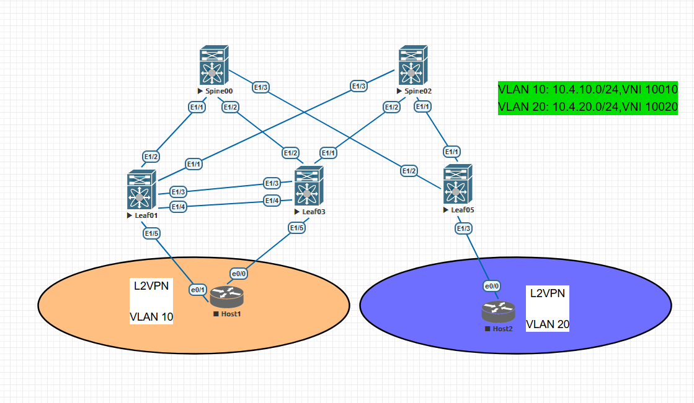
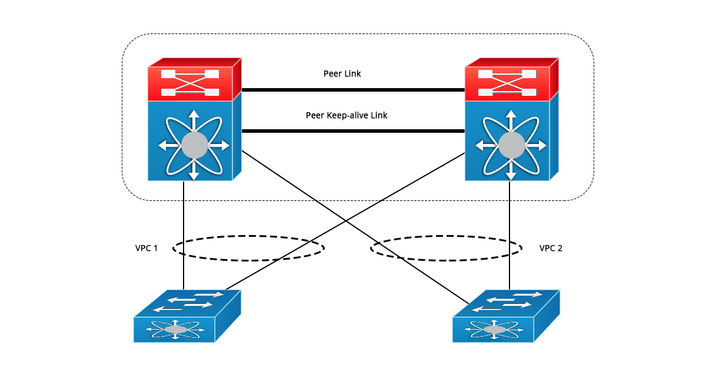
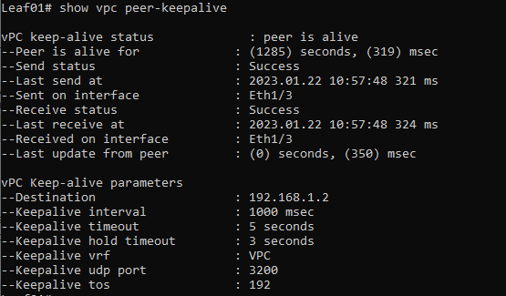
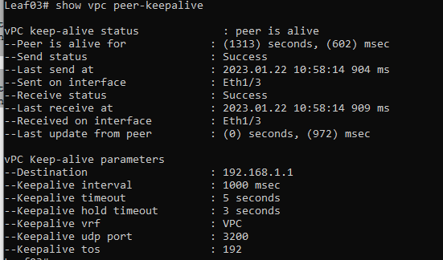
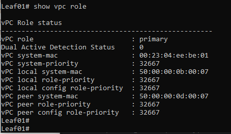
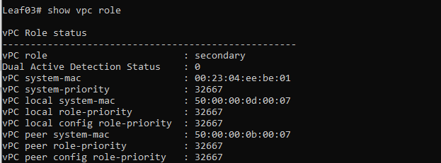
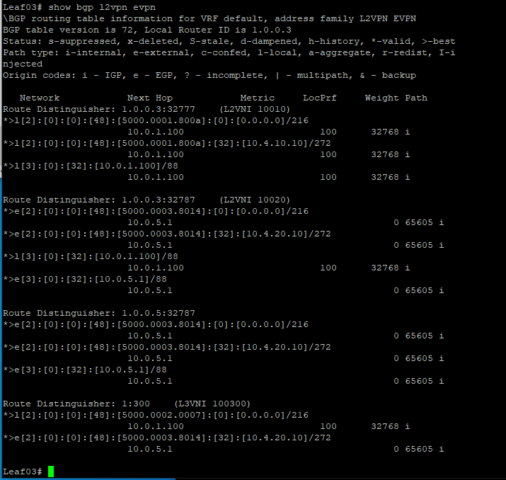
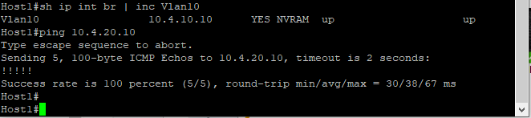

# OTUS - Дизайн сетей ЦОД
***
## LAB 07 - VXLAN. VPC

### -Цели
1. Подключите клиентов 2-я линками к различным Leaf
2. Настроите агрегированный канал со стороны клиента
3. Настроите VPC для работы в Overlay сети
4. План работы, адресное пространство, схема сети, настройки - зафиксированы в документации

				Выполнение Работы
		
		
При выполнении работы использовался эмулятор сетевых устройств  Eve-NG 5.0.1-13. Были задействованы следующие образы:
- 	Nexus 9000v(nxos.7.0.3.I7.2.bin)
- 	Cisco IOL (L3-ADVENTERPRISEK9-M-15.4-2T.bin)

Топология сети выглядит следующим образом:
	
  ###### * Рис 1. Топология сети*
	
Адресация хостов выбирается по методу описанному в  лабораторной работе  №1

Адресация интерфейсов сетевого оборудования также уже была настроена в лабораторной работе № 1

Так же в работе 4,5,6 были настроены underlay eBGP,overlay eBGP,BGP EVPN L2,L3 поэтому в данной лабораторной работе повторные настройки не связанные с настройкой VPC на коммутаторах Cisco Nexus описаны не будут.

Номер VNI образуется путем добавления числа "100" к номеру Vlan

Исходя из этого получается, что:

| Хост | IP | Vlan | VNI | Interface |
| --- | --- | --- | --- | --- |
| Host1 | 10.4.10.10 |10|10010 | Leaf01-E1/5(Po1-VPC1) |
| Host1 | 10.4.10.10 |10|10010 | Leaf03-E1/3(Po1-VPC1) |
| Host2| 10.4.20.10 | 20 |10020| Leaf05-E1/3 |

Что такое VPC?
Что мы будем настраивать?

В данном случае, исходя из нашей задачи нам необходимо настроить VPC. Давайте сперва разберем что это и в чем функциональность и предназначение этой "штуки".

VPC(Virtual Port Channel) - это проприетарная технология Cisco,по примеру MLAG,существующая только на коммутаторах серии Nexus,она  позволяет объединить два отдельных физических коммутатора в один логический и представиться хосту как один коммутатор,чем-то похоже на стэкирование,но это не оно. 

Цель данной технологии в построении отказоустойчивой, удобной, гибкой сети. Достигается все это путем как и было сказано выше в объединение двух физических коммутаторов в один логический, технология позволяет собирать агрегированные каналы в сторону клиента на разных физических нодах в один логический канал для клиента,просто вау)

###### * Рис 2. VPC domain*

Таким образом:

- В случае поломки одной ноды - хост останется доступен;
- В случае разрыва одного линка - хост останется доступен
- Нам не приходится применять STP
- Увеличивается пропускная способность в 2 раза

Все это предоставляет нам хорошие преимущества и обеспечивает высокую доступность сервисов.

И так,в сегодняшней работе мы настроим VPC домен на двух коммутаторах Nexus,добавим к базовой конфигурации доп.фичи: Peer-switch и Peer-gateway,ARP/ND(Зачем и почему будет рассказано позже) и все это добавится к прошлой конфигурации с VXLAN EVPN L3.

Начнем

#### Конфигурация

Сперва включим фичи vpc и lacp

	Leaf01
		feature vpc
		feature lacp 
  	Leaf03
  		feature vpc
		feature lacp 
Затем настроим выделенный для связи с соседним устройством линк E1/3(См.топологию) как keep-alive линк,он используется для проверки доступности соседа.

Вынесем его в отдельный VRF(best-practice) и настроим линк+сам VPC домен для устройств

	Leaf01
		vrf context VPC
		interface Ethernet1/3
	  		no switchport
	  		vrf member VPC
	  		ip address 192.168.1.1/24
	  		no shutdown
	  	int lo0
	  	ip address 10.0.1.100/32 secondary
		vpc domain 1
	  		peer-keepalive destination 192.168.1.2 source 192.168.1.1 vrf VPC
  	Leaf03
  		vrf context VPC
		interface Ethernet1/3
	  		no switchport
	  		vrf member VPC
	  		ip address 192.168.1.2/24
	  		no shutdown
	 	intlo0
	 	ip address 10.0.1.100/32 secondary
		vpc domain 1
	  		peer-keepalive destination 192.168.1.1 source 192.168.1.2 vrf VPC

Далее настроим VPC Peer link, это будет интерфейс E1/4(См.топологию),он отвечает за :
- Передача VLAN, которые используются VPC парой
- Передача CFS сообщений(служебный трафик)
- Передача BUM сообщений между VPC пирами
 
 
Настроим:
  		
	Leaf01
		int po1 
			switchport mode trunk
			spanning-tree port type network
	 		vpc peer-link
	 	int e 1/4
	 		switchport mode trunk
	 		channel-group 1 mode active
	 Leaf03
		int po1 
			switchport mode trunk
			spanning-tree port type network
	 		vpc peer-link
	 	int e 1/4
	 		switchport mode trunk
	 		channel-group 1 mode active
 		
Проверим настройку VPC домена и линков:

###### * Рис 3. Show peer keep-alive Leaf01*

###### * Рис 4. Show peer keep-alive Leaf03*

Как видим,линки для мониторинга соседа в VPC паре настроены корректно, посмотрим далее что с самим VPC доменом

###### * Рис 5. Show vpc roleLeaf01*

###### * Рис 6. Show vpc role Leaf03*

Как видим настройка VPC домена также прошла успешно,коммутаторы выбрали кто главный-запасной,сформировали VPC общий мак-адрес.

Перейдем к настройке агреггированого канала на базе LACP в сторону клиента. Выбор номера Port-channel будет основываться на нумерации интерфейса в сторону клиента,т.к. на клиента смотрит интерфейс E 1/5,значит Port-channel будет 5.

	Leaf01
	int po5
	  	switchport mode trunk
	  	vpc 5
 	int e 1/5
 		switchport mode trunk
 		channel-group 5
 	Leaf03
	int po5
	  	switchport mode trunk
	  	vpc 5
 	int e 1/5
 		switchport mode trunk
 		channel-group 5

Настроим хост:

	interface Vlan10
		ip address 10.4.10.10 255.255.255.0
	ip route 0.0.0.0 0.0.0.0 10.4.10.1
	interface Vlan10
		ip address 10.4.10.10 255.255.255.0
	interface Port-channel1
		switchport access vlan 10
		switchport mode access
	interface GigabitEthernet0/0
		switchport mode access
		channel-group 1 mode on
	interface GigabitEthernet0/1
		switchport mode access
		channel-group 1 mode on
Проверим успешно ли настроился агрегированный порт и конфигурацию VPC домена:

###### * Рис 6. Show vpc Leaf01*

По-моему все сконфигурировалось хорошо,Leaf01 и Leaf03 друг друга видят,проверка конфигурации успешна.

(P.S. Так и не нашел проблему инконсистентности ТИПА-2,думаю баг,сейчас главное чтобы работала лаба)

Далее нам следует настроить:
- VPC Peer-Switch(Выступает для хоста полностью как одна логическая коробка,нужно к примеру в STP)
- VPC Peer-gateway(Используется для того,чтобы ус-ва могли отвечать своим VPC маком хостам)
- Ip arp Syncronize(В случае аварии на одном из устройств при помощи CFS сиинхронизирует ARP таблицы между хостами)

Перейдем к настройке:

	Leaf01
		vpc domain 1
			peer-gateway
			peer-switch
			ip arp synchronize
 	Leaf03
		vpc domain 1
			peer-gateway
			peer-switch
			ip arp synchronize

Далее для завершения настройки VPC в VXLAN нам еще потребуется настроить PIP и virtual-rmac. Эти команды обязательные для настройки, они позволяют избежать black-holing в нашей сети VxLAN.
	
	Leaf01
		router bgp 65601
			address-family l2vpn evpn
				advertise-pip
		advertise virtual-rmac
	Leaf03
		router bgp 65601
			address-family l2vpn evpn
				advertise-pip
		advertise virtual-rmac
#### Завершение
Проверим таблицу маршрузитазии BGP Evpn

###### * Рис 7. Show bgp l2vpn evpn Leaf01*

Как видим тут все в порядке,проверим доступность хостов от Host1 до Host2

###### * Рис 8. Проверка доступности*

Тут тоже все работает

Итого:

Мы настроили VPC домен на Cisco Nexus,добились работоспособности, разобрали пошаговую конфигурацию, на собственном опыте разобрались в типичных ошибках,набили руку, и получили опыт.Все работает и отлично!
 

1. [Spine00](Spine00.conf)
2. [Spine02](Spine02.conf)
3. [Leaf01](Leaf01.conf)
4. [Leaf03](Leaf03.conf)
5. [Leaf05](Leaf05.conf)
6. [Host1](host1.conf)
7. [Host2](host2.conf)

#### На этом лабораторную работу №7 считаю завершенной
